# 🚀 EgzaminyZSEL

Nowoczesna aplikacja webowa wspierająca przygotowanie uczniów do egzaminów zawodowych oraz ułatwiająca nauczycielom monitorowanie postępów i analizę wyników.

---

# 📚 O projekcie

**EgzaminyZSEL** to platforma stworzona dla uczniów oraz nauczycieli ZSEL, której głównym celem jest uproszczenie procesu przygotowania do egzaminów zawodowych.

Aplikacja umożliwia:
- rozwiązywanie pełnych egzaminów próbnych,
- szybkie losowanie pojedynczych pytań,
- analizę wyników i statystyk,
- zarządzanie bazą pytań,
- generowanie raportów dla nauczycieli.

Projekt został wykonany w technologii **Flutter + Dart** i działa jako aplikacja webowa z możliwością dalszego rozwoju o wersję mobilną.

---

# ✨ Najważniejsze funkcje

## 👨‍🎓 Funkcje dla uczniów

- Rozwiązywanie pełnych egzaminów (40 pytań)
- Tryb „jednego pytania”
- Statystyki użytkownika
- Historia egzaminów
- Podgląd bazy pytań
- Personalizacja motywu aplikacji:
  - jasny,
  - ciemny,
  - inne przygotowane przez nas motywy

---

## 👨‍🏫 Funkcje dla nauczycieli

- Dodawanie i edycja pytań
- Usuwanie pytań
- Zarządzanie treściami
- Analiza trudności pytań
- Statystyki uczniów i kwalifikacji
- Generowanie raportów
- Zarządzanie administratorami

---

# 🔐 Bezpieczeństwo

Aplikacja wykorzystuje logowanie Microsoft OAuth2.

## Mechanizmy zabezpieczeń

- logowanie wyłącznie szkolnym kontem,
- rozpoznawanie nauczycieli po bazie administratorów,
- blokada kopiowania treści pytań,
- automatyczne zakończenie egzaminu po opuszczeniu karty.

---

# 📊 Statystyki i analiza danych

System automatycznie zapisuje:
- wyniki uczniów,
- historię egzaminów,
- czas rozwiązywania,
- skuteczność odpowiedzi,
- poziom trudności pytań.

Dzięki temu nauczyciele mogą szybko sprawdzić:
- które zagadnienia sprawiają największy problem,
- średnie wyniki uczniów,
- aktywność uczniów,
- postępy w czasie.
- średnie wyniki całych kwalifikacji

---

# 🗄️ Baza danych

Wszystkie dane przechowywane są na szkolnym serwerze SQL.

Baza danych obsługuje:
- pytania,
- odpowiedzi,
- multimedia,
- statystyki,
- raporty,
- historię egzaminów.

---

# 🖼️ Obsługa multimediów

System wspiera:
- obrazy,
- filmy,
- pytania multimedialne

Pozwala to odwzorować strukturę rzeczywistych egzaminów zawodowych.

---

# 🛠️ Technologie

## Frontend
- Flutter
- Dart

## Backend / Integracje
- Microsoft OAuth2
- SQL Server
- REST API

---

# 📱 Responsywność

Aplikacja została zaprojektowana tak, aby działała zarówno na:
- komputerach,
- tabletach,
- urządzeniach mobilnych.

---

# ♿ Dostępność

Projekt uwzględnia potrzeby osób z niepełnosprawnościami:
- czytelna typografia,
- minimalistyczny interfejs,
- ograniczenie nadmiaru animacji,
- wygodna obsługa na mniejszych ekranach.

---

# 🎯 Cel projektu

Celem projektu jest stworzenie nowoczesnego, bezpiecznego i wygodnego środowiska wspierającego przygotowanie do egzaminów zawodowych oraz ułatwiającego nauczycielom analizę postępów uczniów.

---

# 📷 Screeny aplikacji

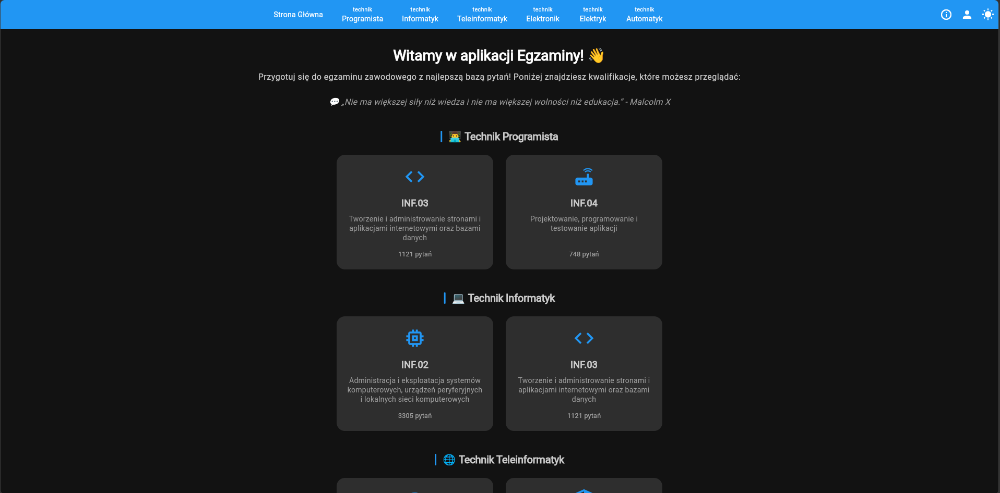

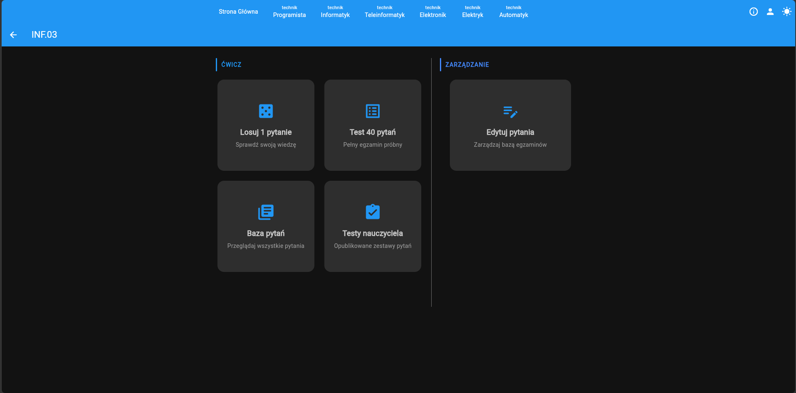

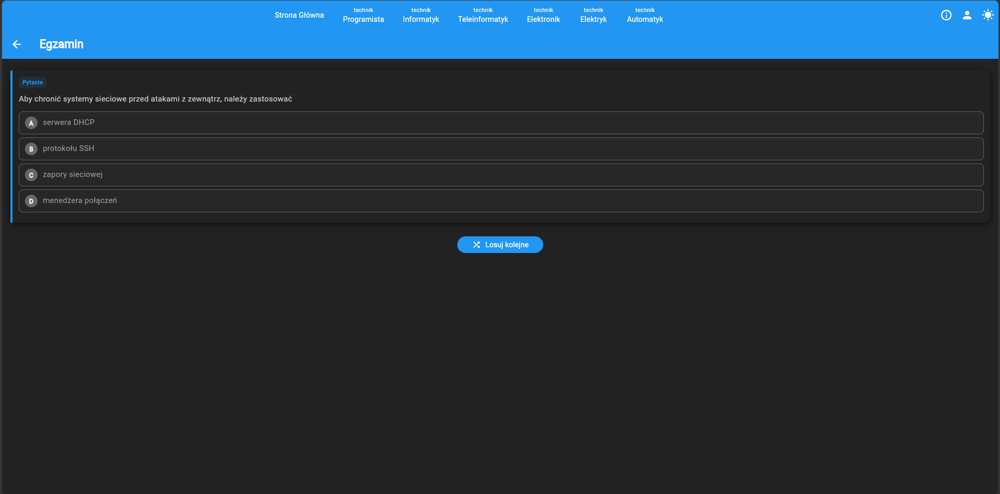

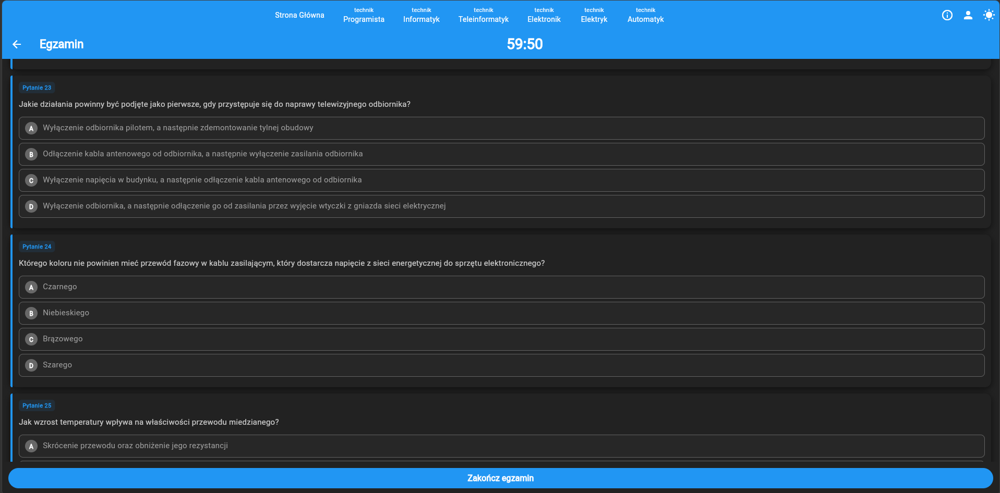

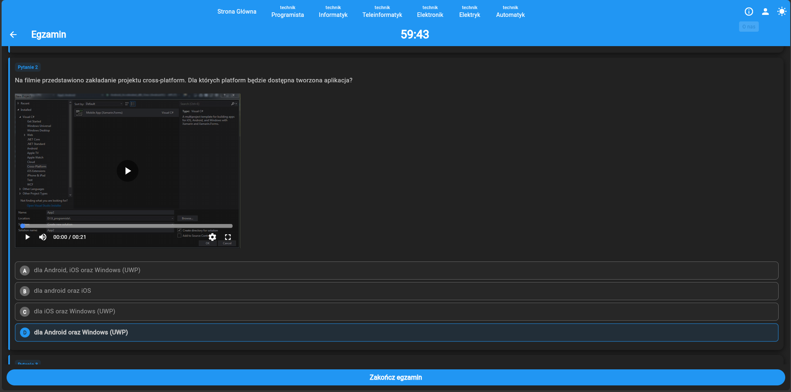

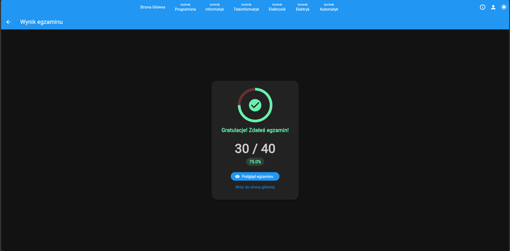

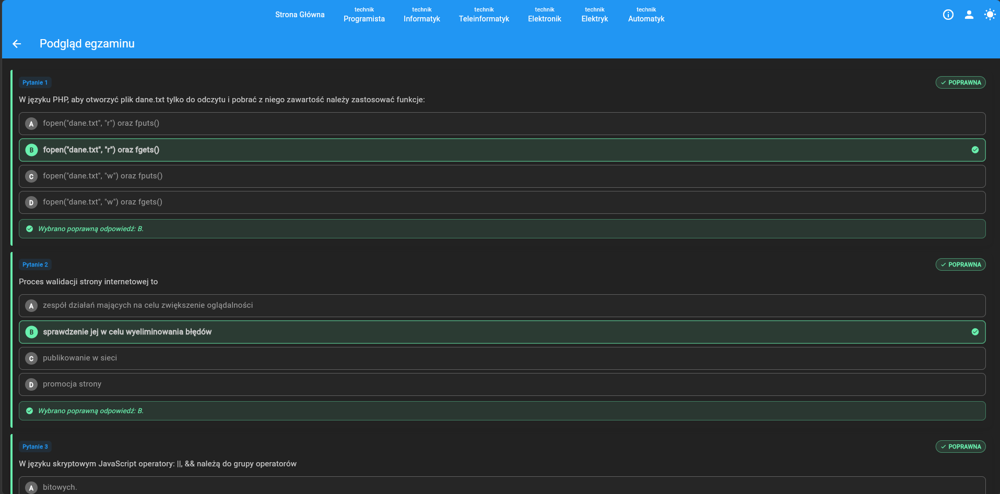

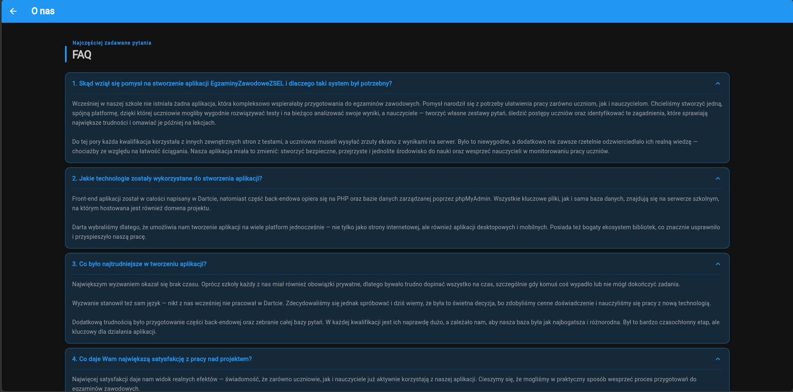

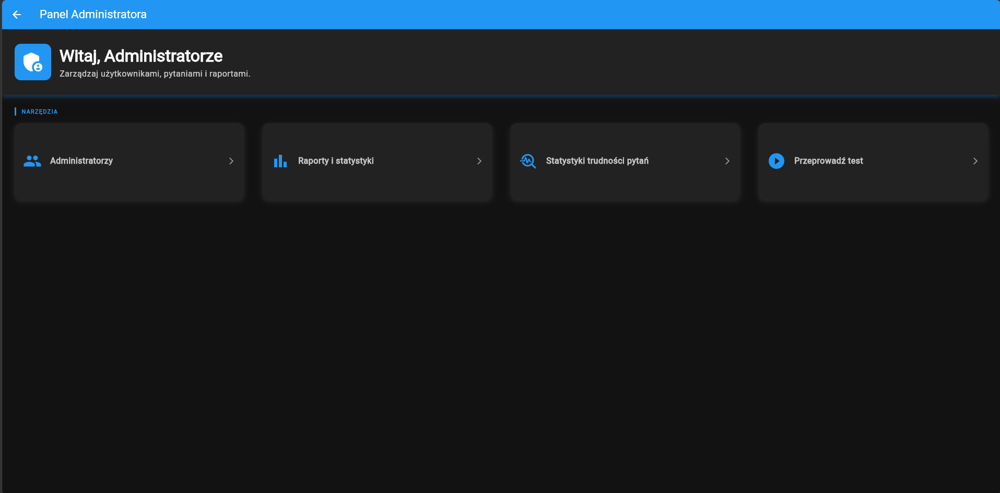

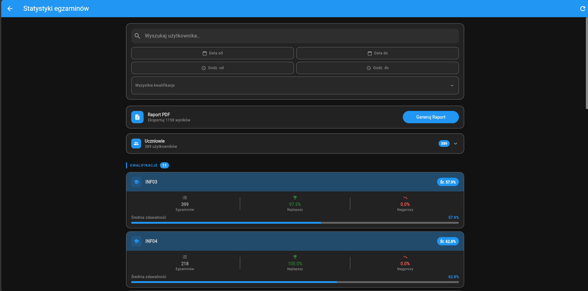

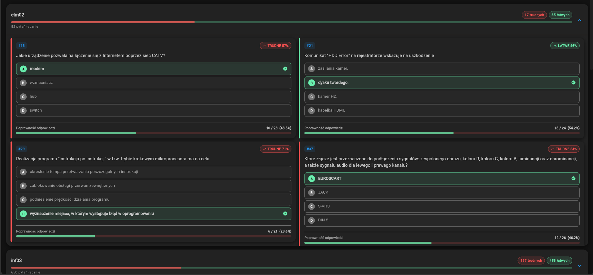

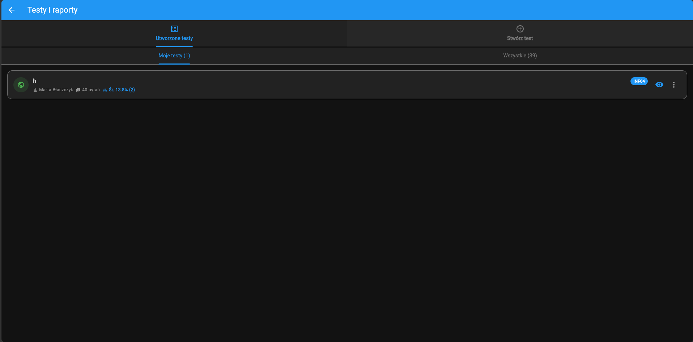

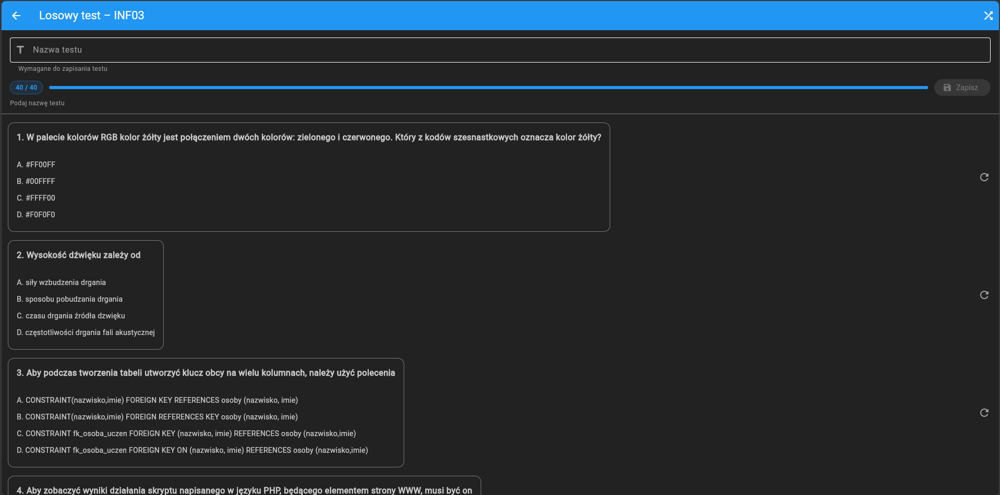

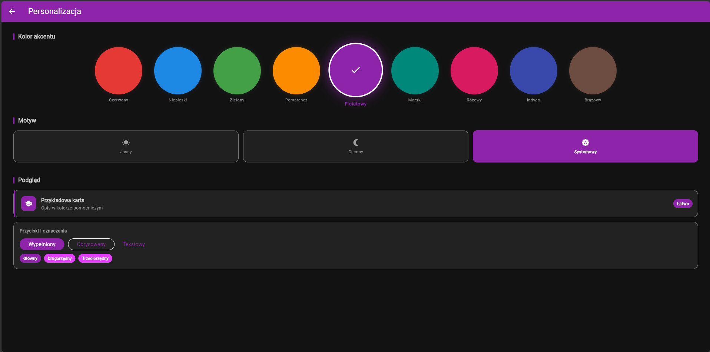

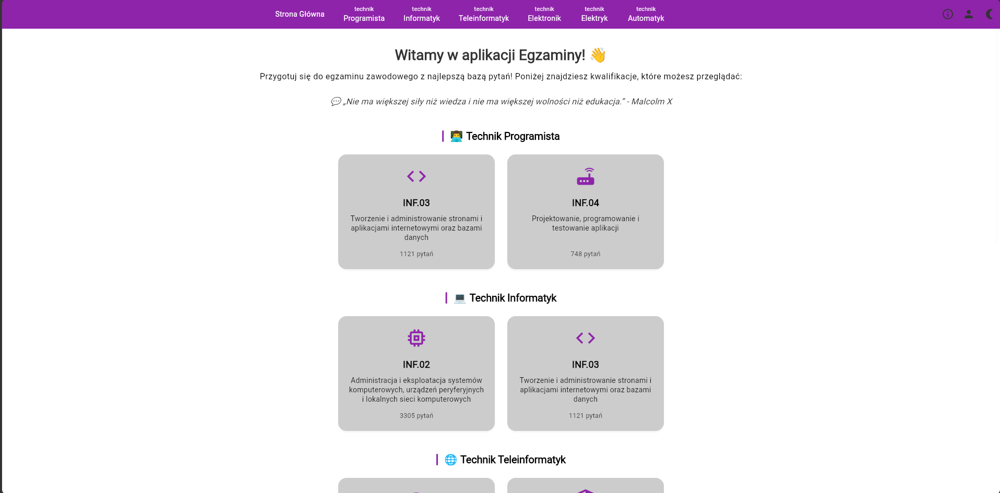

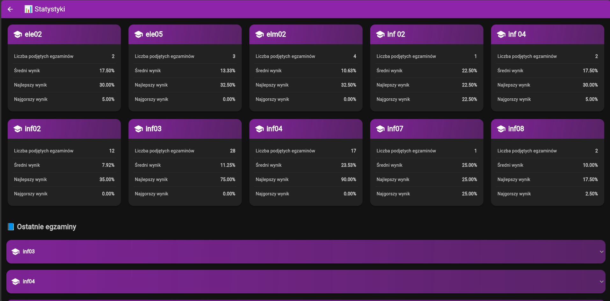

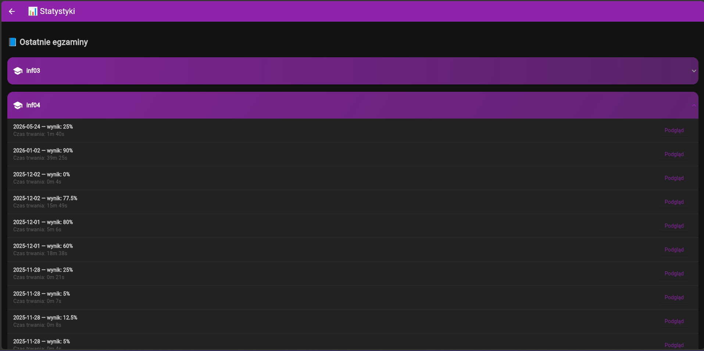
---

# 🌐 Dostępność projektu

```txt
https://egzaminy.zsel.edu.pl
```

---

# 👨‍💻 Autorzy

Projekt wykonany przez uczniów ZSEL jako system wspierający przygotowanie do egzaminów zawodowych.

---

# 📄 Licencja

Projekt przeznaczony do użytku edukacyjnego.
